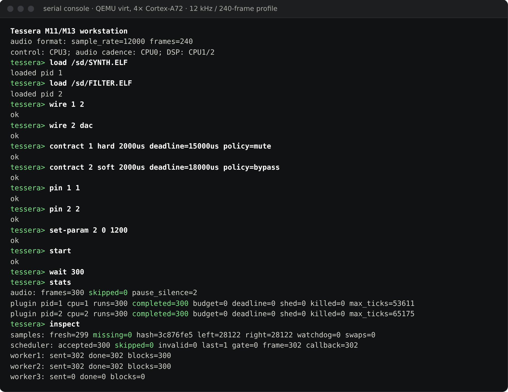
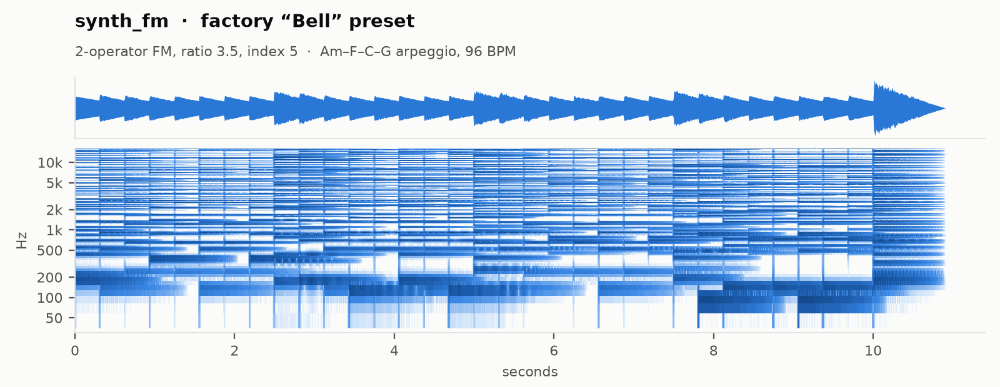
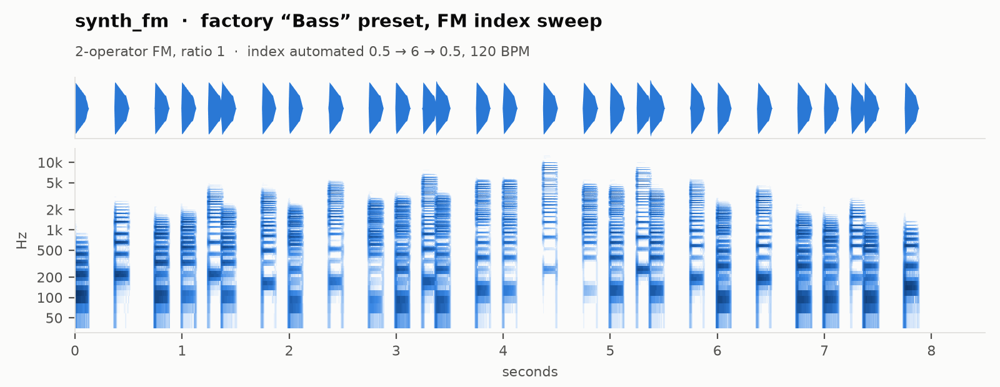
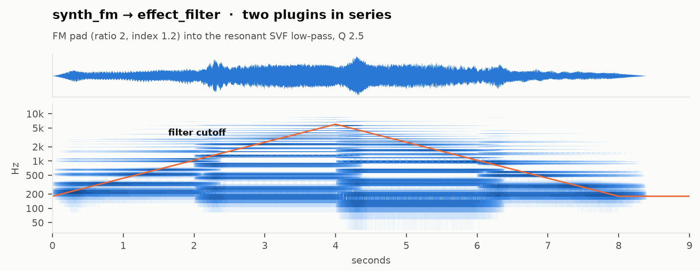

# Tessera

**A bare-metal AArch64 audio runtime that treats every DSP plugin as untrusted code.**

Tessera is an experimental kernel plus plugin platform for a Cortex-A audio device
(target: a Raspberry Pi Compute Module 4 driving a PCM5102 DAC, i.e. a programmable
stompbox or desktop instrument). Its one core idea is that **loading a plugin should
not mean trusting it with the whole instrument**. A plugin is an ordinary AArch64 ELF.
It runs at EL0 in its own ARMv8 address space, under a CPU-time budget enforced by the
generic timer, and it can't make syscalls from its DSP path. If a plugin dereferences a
wild pointer, issues an illegal `SVC`, or spins forever, only that plugin is killed.
The audio engine and the other plugins keep running.

There is no Linux, libc, or dynamic linker underneath. The kernel is roughly 20,000
lines of freestanding C and assembly: the MMU and process code, an ELF loader, an audio
graph, a real-time scheduler, a FAT filesystem, and a serial shell. It ships with a
plugin SDK (C and Rust) and a library of allocation-free DSP blocks for plugin authors.

---

## Status at a glance

| Question | Answer |
| --- | --- |
| Does it run? | **Yes, under QEMU `virt`** (4× Cortex-A72, MMU on, real exception vectors, real EL0 plugins). |
| Does it run on a Raspberry Pi / CM4? | **Not yet.** Nothing has been validated on real BCM2711 silicon. That work is tracked in [#105](https://github.com/KrasForge/Tessera/issues/105)–[#108](https://github.com/KrasForge/Tessera/issues/108). |
| Can I hear it? | **Not from QEMU, and not from a board yet.** QEMU doesn't emulate the BCM2711 I2S block. The emulated workstation renders PCM into memory, and tests check it by sample value and hash. What you *can* hear is the reference plugins' own DSP, rendered on a desktop by the offline host: see [Hear it](#hear-it). |
| Is the isolation real? | **Yes.** Each plugin gets its own translation tables, runs at EL0, and is preempted by the timer. Faults are handled by the kernel's real exception path, and QEMU tests exercise every fault class. |
| Is it a product? | **No.** It's a working, heavily tested architecture in emulation. It isn't a finished pedal, and it makes no claims about measured hardware latency. |

---

## See it

### A live graph from the serial shell



The integrated 4-core image under QEMU, driven over its PL011 serial console. Two
plugins are loaded from the FAT volume into their own EL0 address spaces, wired
synth → low-pass → DAC, given temporal contracts, pinned to worker cores, and started.
After 300 frames both have completed every block and the DAC has missed none.
(`SYNTH.ELF` in this image is the 440 Hz sine test plugin.)

### Fault containment, live


The same session, still running. `CRASH.ELF` writes through a NULL pointer on its
fourth block, and `HOG.ELF` renders three blocks and then spins forever inside
`process_block`. The kernel records the crash (`esr=2449473606` is 0x92000046, a data
abort from EL0 on a write; `far=0` is the NULL address) and kills it. The generic timer preempts the
hog on three consecutive blocks (`budget=3`), and then the hog is killed too. Synth and
filter never notice: 604 of 604 blocks completed, zero skipped frames, and nothing
missing at the DAC.

Both screenshots are one unedited session
([raw log](docs/media/workstation-session.log)), captured with the 12 kHz / 240-sample
(20 ms) frame profile that the console acceptance test uses, so host-vCPU
descheduling isn't mistaken for a deadline miss (see [Verification](#verification)).
To reproduce it, type the same commands into:

```sh
make run-arm-workstation CROSS_COMPILE=aarch64-linux-gnu- \
     SESSION_DEFS="-DSESSION_FRAMES=240 -DSESSION_RATE=12000"
```

## Hear it

These clips come from the in-tree reference plugins
([`synth_fm`](plugins/synth_fm), [`effect_filter`](plugins/effect_filter)), rendered
by the [offline host](tools/offline_host.c). The offline host compiles the plugin's own C
for the desktop and drives it through the same ABI entry points the kernel calls
(`plugin_init`, `plugin_set_param`, `plugin_process_block`), block by block, from an
automation script. They were **not** recorded from QEMU or
from a board. After rendering, each clip was only normalised to −1 dBFS peak and
encoded to MP3. There is no EQ, compression, reverb, or mixing. Click a spectrogram to
play its clip.

<a href="docs/media/demo-bell.mp3?raw=true"><picture>
  <source media="(prefers-color-scheme: dark)" srcset="docs/media/demo-bell-dark.png">
  
</picture></a>

<a href="docs/media/demo-bass.mp3?raw=true"><picture>
  <source media="(prefers-color-scheme: dark)" srcset="docs/media/demo-bass-dark.png">
  
</picture></a>

<a href="docs/media/demo-chain.mp3?raw=true"><picture>
  <source media="(prefers-color-scheme: dark)" srcset="docs/media/demo-chain-dark.png">
  
</picture></a>

| Clip | What you're hearing |
| --- | --- |
| [Bell](docs/media/demo-bell.mp3?raw=true) | `synth_fm` with its embedded factory **Bell** preset (2-operator FM, ratio 3.5, index 5), playing an arpeggio on the SDK's 8-voice engine. |
| [Bass](docs/media/demo-bass.mp3?raw=true) | The factory **Bass** preset (ratio 1), with the FM index automated 0.5 → 6 → 0.5 through `plugin_set_param`. |
| [Synth → filter](docs/media/demo-chain.mp3?raw=true) | Two plugins in series, the same `wire 1 2; wire 2 dac` graph as the shell session: an FM pad into the resonant SVF low-pass, with its cutoff swept 180 Hz → 6 kHz → 180 Hz. |

To regenerate every clip and image (needs a host C compiler, ffmpeg, and Python with
numpy and matplotlib), run `python3 scripts/render_demos.py`. The script contains the
exact notes and parameter automation for each clip.

---

## What Tessera is

### 1. An isolation-first plugin runtime

Plugin isolation is part of the audio architecture itself, not a wrapper around one
trusted process:

- **Memory isolation.** Each plugin gets a separate translation root. Kernel memory,
  MMIO, and other plugins are unmapped, and code and data are mapped W^X. The host maps
  audio buffers, the parameter queue, and the event queue in explicitly.
- **Time isolation.** `plugin_process_block` runs under a generic-timer budget. An
  overrunning block is interrupted, and its partial output is erased. Three offences in
  a row kill the plugin.
- **Syscall isolation.** An `SVC` from the plugin body is fatal. All kernel transitions
  go through a host-controlled trampoline, and the DSP path makes no syscalls per block.
- **Validated loading.** ELF images are bounds-checked and ABI-version-checked before
  anything is mapped. Images with undefined imports are rejected. A failed load or
  admission rolls back completely.
- **Safe teardown.** A killed process can't be re-entered, and its resources are freed
  only after the worker cores have drained. The resilience test checks for zero frame
  leaks over repeated fault cycles.

The plugin ABI is frozen at major version 1 (five C exports). It has grown by
backward-compatible minor versions up to **v1.3**, which added note/CC events, a
transport snapshot, MPE, and sample-accurate event offsets. See
[`docs/plugin-abi.md`](docs/plugin-abi.md) and [`CHANGELOG.md`](CHANGELOG.md).

### 2. A real-time, multicore audio engine

CPU0 owns the audio cadence and the graph. Plugins run as isolated jobs on worker
cores. Before anything executes, a temporal runtime admits the graph against each
plugin's contract:

- period (in whole blocks), within-frame deadline, CPU budget, and criticality class
  (HARD / SOFT / BEST_EFFORT);
- precedence-constrained EDF within each class, dependency-aware placement on CPU1-3,
  and optional core pinning;
- per-plugin overrun policies: mute, bypass, kill, kill after N strikes, or degrade;
- graph changes published only at drained frame boundaries, with guarded reclamation of
  the old graph;
- feedback edges, plugin delay compensation, and seqlock-published per-plugin
  service-time counters.

A late worker is skipped and the miss is attributed to it; CPU0 is never made to wait.
See [`docs/temporal-contracts.md`](docs/temporal-contracts.md) for the exact model and
its limits.

### 3. A serial workstation

The integrated application is a 4-core QEMU image. CPU0 runs audio, CPU1-2 run DSP,
and CPU3 runs a UART shell. From that shell you can build and manage a live graph
without compiling a control program:

```text
load /sd/SYNTH.ELF
load /sd/GAIN.ELF
wire 1 2
wire 2 dac
contract 1 hard 400us deadline=1000us policy=mute
contract 2 soft 400us deadline=1200us policy=bypass
pin 1 2
pin 2 1
set-param 2 0 0.5
start
stats
ls
patch save /sd/LIVE.TSP
```

`/sd` is a RAM-backed FAT volume that is preloaded at boot with the bundled plugin
ELFs. In this image, `SYNTH.ELF` is a 440 Hz sine test plugin. `patch load` rebuilds
plugins, parameters, contracts, affinity, and wiring. The acceptance test saves a
session, shuts QEMU down, boots a fresh emulator with only the FAT image restored,
reloads the patch, and requires bit-identical PCM output. See
[`docs/shell.md`](docs/shell.md) and
[`docs/m11-m13-workstation.md`](docs/m11-m13-workstation.md).

### 4. A plugin SDK and DSP library

Plugin authors need only [`sdk/`](sdk/) and a stock AArch64 toolchain. The SDK includes
the ABI header, a W^X link script, a static helper library, a C build template, an
example plugin, and a `no_std` Rust wrapper
([`sdk/rust/tessera-plugin`](sdk/rust/tessera-plugin)). The
[offline host](tools/offline_host.c) runs a plugin against a WAV file on your desktop,
with no board or QEMU needed.

`libtessera.a` is real-time safe: no allocation, no libc. It provides:

- smoothers, RBJ biquads, SVFs, ADSRs, delay lines, envelope followers;
- polyBLEP, wavetable, and FM oscillators; a streaming sampler; a polyphonic voice engine;
- compressor, EQ, gate, chorus, delay, overdrive, and FDN reverb;
- FFT/rFFT, partitioned convolution, a phase vocoder (pitch shift and time stretch),
  and a spectrum analyser;
- a modulation matrix, MPE decoding, and a sample-accurate event splitter.

These live in the SDK, not the kernel, so plugins get useful DSP without weakening
isolation. The in-tree [`synth_fm`](plugins/synth_fm), [`sampler`](plugins/sampler),
and [`effect_filter`](plugins/effect_filter) plugins are built on them. Start with
[`docs/getting-started.md`](docs/getting-started.md).

---

## How mature each part is

Tessera has a lot of code, and not all of it is equally connected. The table below says
honestly where each piece stands.

| Tier | What's in it |
| --- | --- |
| **Integrated: runs in the workstation image** (`make run-arm-workstation`) | MMU and processes, exception vectors, ELF loader, SVC gate, sandbox audit, CPU-budget enforcement, temporal admission and multicore workers, audio graph, lock-free parameter queues, plugin manager, FAT/VFS, patches and sessions, shell. |
| **Proven in dedicated QEMU fixtures** (real kernel code on QEMU `virt`, but not yet linked into the workstation) | Per-plugin memory quota at load time, safe-mode dry bypass, crossfaded patch switching, plugin hot-reload, crash black-box, live parameter IPC, MIDI and CV/Gate input paths, audio-input graph nodes and input→effect→output round trip, callback latency and jitter measurement. The BCM2711 I2S and DMA drivers are exercised only as an API smoke test against scratch RAM, because QEMU has no I2S block. |
| **Host-tested building blocks** (portable C, unit-tested with ASan/UBSan, not wired into any running image) | Master transport, tempo sync and tap tempo, arpeggiator, looper, scene morphing, mixer, limiter, profiler, patch banks with Program Change, control-surface mapping with MIDI learn, an OSC remote-editor codec, multichannel routing, linear and polyphase-FIR sample-rate conversion, syscall/I/O-rate quota accounting (the kernel hook is a no-op by default), and OLED UI layout (no display driver). Also: **USB audio**, which is UAC1 descriptor parsing and isochronous framing only, with no USB host controller driver. **Plugin packages**, which is a verifier for HMAC-SHA256 (symmetric) and key revocation, not in the load path. **Secure/measured boot**, which is image verification and a PCR-style hash chain, not in the boot path. |
| **Pi image** (`make arm` → `kernel8.img`) | Boots, prints the UART banner, enables the MMU, runs the M1-M4 self-tests (processes, faults, scheduler, audio, and timer), and blinks the CM4 LED. It doesn't run the plugin host or the workstation yet, and it hasn't been booted on real hardware. |

Wiring the building blocks into the workstation, and bringing the whole thing up on
the BCM2711, is the remaining path from "architecture" to "instrument".

---

## Architecture

```text
                        trusted kernel (EL1)

         audio cadence · graph ownership · admission · fault handling
                               CPU0
                                |
                       frame-boundary kick
                     /          |          \
                 worker       worker      control
                  CPU1         CPU2      CPU3 (shell, file I/O,
                   |            |         ELF loading, printing)
               EL0 PID A    EL0 PID B
              +---------+  +---------+
              | private |  | private |
              | VA space|  | VA space|
              +---------+  +---------+
                    \          /
             host-mapped audio buffers
                         |
                      DAC sink
```

The kernel owns lifecycle, graph publication, timer enforcement, and fault handling.
Plugin code never becomes privileged. ELF parsing, filesystem access, and
initialization run on the control core, never in the audio IRQ.

---

## Quick start

### Run the workstation (QEMU)

```sh
sudo apt-get install -y gcc-aarch64-linux-gnu binutils-aarch64-linux-gnu qemu-system-arm
make run-arm-workstation CROSS_COMPILE=aarch64-linux-gnu-
```

At the prompt, type `help`. `inspect` shows real PCM samples and a block hash, and
`quit` exits.

### Run a third-party-style plugin under QEMU

```sh
make test-arm-sdk-qemu CROSS_COMPILE=aarch64-linux-gnu-
```

This builds a plugin with only the SDK, boots Tessera, loads the plugin into an isolated
EL0 process, and checks its audio output and parameter control.

### Build the Pi image

```sh
make arm-install-deps   # Ubuntu/Debian: clang, lld, llvm, binutils
make arm                # LLVM by default → build/arm/kernel8.img
make arm CROSS_COMPILE=aarch64-linux-gnu-   # or a GNU cross-toolchain
```

See [`docs/build-arm.md`](docs/build-arm.md) for the CM4 boot layout and
[`docs/hardware.md`](docs/hardware.md) for the DAC, MIDI, and CV wiring.

---

## Verification

Almost every subsystem has its own `make test-arm-*` target, either a host unit suite
under ASan and UBSan or a QEMU `virt` fixture. CI runs them. The main gates:

| Gate | What it proves |
| --- | --- |
| `test-arm-resilience-qemu` | null-access, kernel-write, illegal-SVC, and CPU-hog plugins are killed while a good plugin keeps producing, with no leaks over 10 cycles |
| `test-arm-temporal-all` | contracts, admission, lifecycle races, timer enforcement, and real-EL0 execution |
| `test-arm-m11` | three real EL0 jobs spread across CPU1-3 with zero missed frames; fault containment on every worker core |
| `test-arm-m13` | shell safety, a console-built graph producing real plugin audio, and patch save/reload with an identical DAC hash |
| `test-arm-session-console` | a full workstation session, persistence, and a true two-process cold boot |
| `verify-plugin-abi` | in-tree plugins conform to the frozen ABI |

The QEMU scheduling fixtures use a 12 kHz / 240-sample (20 ms) frame, not the product
48 kHz / 64-sample profile. This keeps host-vCPU descheduling from being mistaken for a
Cortex-A72 deadline miss. The assertions on missed frames, faults, graph state, and PCM
stay strict, but none of it counts as hardware timing evidence. Real latency and jitter
numbers have to come from the board ([`docs/latency.md`](docs/latency.md)).

---

## Road to hardware

The thesis (MMU-isolated plugins on a Cortex-A audio device) still needs to be shown on
real silicon:

- [#105](https://github.com/KrasForge/Tessera/issues/105): Pi 4 / CM4 boot, interrupts,
  serial, mailbox, and EMMC2/SD bring-up;
- [#106](https://github.com/KrasForge/Tessera/issues/106): 48 kHz I2S + DMA to the
  PCM5102 with sustained zero-underrun playback;
- [#107](https://github.com/KrasForge/Tessera/issues/107): QEMU `raspi4b` as a required
  BCM2711 CI gate;
- [#108](https://github.com/KrasForge/Tessera/issues/108): published CM4 latency and
  jitter numbers, plus a recorded physical fault-containment demo.

[`MILESTONES.md`](MILESTONES.md) has the history and the done-when criteria.
[`docs/hardware-targets.md`](docs/hardware-targets.md) and
[`docs/feature-ideas.md`](docs/feature-ideas.md) cover longer-range ideas.

---

## Repository map

```text
arch/arm64/   kernel: MMU/processes, loader, sandbox, graph, temporal scheduler,
              session/shell, and the host-tested building blocks
boot/         AArch64 boot entry and Pi config.txt
drivers/      PL011 UART, GIC, GPIO, mailbox, BCM2711 I2S/DMA, MIDI UART, SPI
audio/        sine generator used by bring-up and test plugins
include/      public plugin ABI header
plugins/      reference plugins (synth, sampler, filter, gain…) and adversarial ones
sdk/          standalone plugin SDK, DSP library, C example, Rust wrapper
tests/        host unit suites, QEMU virt fixtures, golden-audio references
tools/        offline WAV plugin host, golden-audio checker
scripts/      QEMU timing and workstation acceptance runners, README demo renderer
docs/         ABI, shell, temporal model, reliability, hardware, and verification notes;
              docs/media/ holds the README screenshots, session log, and audio clips
```

## Documentation

- **Write a plugin:** [`docs/getting-started.md`](docs/getting-started.md), [`sdk/README.md`](sdk/README.md)
- **Plugin contract:** [`docs/plugin-abi.md`](docs/plugin-abi.md)
- **Serial workstation:** [`docs/shell.md`](docs/shell.md), [`docs/m11-m13-workstation.md`](docs/m11-m13-workstation.md)
- **Temporal contracts:** [`docs/temporal-contracts.md`](docs/temporal-contracts.md)
- **Fault containment demo:** [`docs/demo.md`](docs/demo.md)
- **Reliability mechanisms:** [`docs/reliability.md`](docs/reliability.md)
- **Signal I/O, transport, control:** [`docs/signal-io.md`](docs/signal-io.md), [`docs/transport.md`](docs/transport.md), [`docs/control-surface.md`](docs/control-surface.md)
- **Latency methodology:** [`docs/latency.md`](docs/latency.md)
- **Hardware:** [`docs/hardware.md`](docs/hardware.md), [`docs/hardware-targets.md`](docs/hardware-targets.md)

## Origin

Tessera started as a fork of [IKOS](https://github.com/Ikey168/ikos), an x86 teaching
OS. That tree has been removed; its history remains in Git. What carried over is the
small-kernel, process-isolation mindset. The AArch64 kernel, audio engine, plugin
platform, scheduler, and SDK are Tessera's own.

## License

MIT. See [`LICENSE`](LICENSE).
