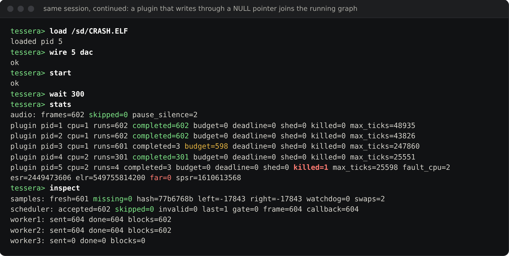

# Tessera

**A bare-metal AArch64 audio runtime that schedules every DSP plugin by contract.**

Tessera is an experimental kernel and plugin platform for a Cortex-A audio device
(target: a Raspberry Pi Compute Module 4 driving a PCM5102 DAC, i.e. a programmable
stompbox or desktop instrument). Every plugin runs under a **temporal contract**: how
often it runs (its period, in whole blocks), how much CPU it may use (its budget), when
it must be finished (its deadline within the frame), and how much it matters (HARD,
SOFT or BEST_EFFORT).

Before a graph runs, the kernel *admits* it. It builds the worst-case frame in exactly
the order the workers will execute it, including dependencies between plugins and
declared kernel overhead. It refuses any contract that can't meet its deadline and says
by how much. While the graph runs, the generic timer enforces every budget. A plugin
that overruns gets the policy it declared: mute, bypass to the dry signal, kill, kill
after N strikes, or run less often. CPU0 owns the audio cadence and never waits for a
late worker. Graph and contract changes take effect only at a drained frame boundary.

The contracts can be enforced because a plugin can't cheat them. Each plugin is an
ordinary AArch64 ELF running at EL0 in its own address space. It can't mask the timer,
touch the scheduler or make syscalls from its DSP path, and if it faults, only that
plugin is killed.

There is no Linux, libc, or dynamic linker underneath. The kernel is roughly 20,000
lines of freestanding C and assembly: the MMU and process code, an ELF loader, an audio
graph, the temporal scheduler, a FAT filesystem, and a serial shell. It ships with a
plugin SDK (C and Rust) and a library of allocation-free DSP blocks for plugin authors.

---

## Status at a glance

| Question | Answer |
| --- | --- |
| Does it run? | **Yes, under QEMU `virt`** (4× Cortex-A72, MMU on, real exception vectors, real EL0 plugins). |
| Does it run on a Raspberry Pi / CM4? | **Not yet.** Nothing has been validated on real BCM2711 silicon. That work is tracked in [#105](https://github.com/KrasForge/Tessera/issues/105)–[#108](https://github.com/KrasForge/Tessera/issues/108). |
| Can I hear it? | **Not from QEMU, and not from a board yet.** QEMU doesn't emulate the BCM2711 I2S block. The emulated workstation renders PCM into memory, and tests check it by sample value and hash. What you *can* hear is the reference plugins' own DSP, rendered on a desktop by the offline host: see [Hear it](#hear-it). |
| Are the timing guarantees real? | **The mechanism is; the numbers aren't yet.** Admission, EDF dispatch and timer enforcement run for real on QEMU's emulated Cortex-A72s. Emulated time depends on the host, though, so no deadline, latency or jitter figure here is hardware evidence. |
| Is the isolation real? | **Yes.** Each plugin gets its own translation tables and runs at EL0. Faults go through the kernel's real exception path, and QEMU tests exercise every fault class. |
| Is it a product? | **No.** It's a working, heavily tested architecture in emulation. It isn't a finished pedal, and it makes no claims about measured hardware latency. |

---

## See it

### Temporal contracts, live


The integrated 4-core image under QEMU, driven over its serial console. Four plugins are
loaded into their own EL0 address spaces and wired synth → filter → `HOG.ELF` → DAC, with
a side branch from the filter into `SOURCE.ELF`. Then their contracts are declared:

- **Admission says no, with numbers.** The synth has a 4 ms budget, and the filter asks
  for 16 ms with an 18 ms deadline. The filter consumes the synth's output in the same
  frame, so the two run back to back. That needs 20.26 ms including declared kernel
  overhead, against 18 ms available (the counter runs at 62.5 MHz, so 1,266,250 versus
  1,125,000 ticks). The contract is refused and nothing changes. At 3 ms it fits.
- **Criticality has to flow downstream.** Demoting the synth to SOFT is refused, because
  a SOFT producer can't feed a HARD consumer in the same frame.
- **An overrunning effect is bypassed, not killed.** `HOG.ELF` renders three blocks and
  then spins forever. Its contract is SOFT with a 2 ms budget and `policy=bypass`. The
  generic timer preempts it on every block (`budget=296`), and its dry input goes to the
  DAC instead. The synth and filter complete 300 of 300 blocks.
- **Plugins run at different rates.** `SOURCE.ELF`, standing in for optional analysis
  work, is BEST_EFFORT at half rate (`period=2blocks`). It runs 150 times in 300 frames,
  on the other DSP core.

### Fault containment, live



The same session, still running. `CRASH.ELF` writes through a NULL pointer on its fourth
block. The kernel records the fault (`esr=2449473606` is 0x92000046, a data abort from
EL0 on a write; `far=0` is the NULL address) and kills it. A fault always kills, whatever
the overrun policy, while a budget overrun gets the declared policy: the hog is still
being bypassed (`budget=598`, `killed=0`). Synth and filter have completed 602 of 602
blocks, with nothing missing at the DAC.

Both screenshots are one unedited session
([raw log](docs/media/workstation-session.log)), captured with the 12 kHz / 240-sample
(20 ms) frame profile that the console acceptance test uses. Emulated time depends on
the host. On some runs a descheduled vCPU shows up as a few skipped frames or shed jobs,
which is QEMU rather than a Cortex-A72 measurement, and is why nothing here is a
hardware timing claim (see [Verification](#verification)). To reproduce the session,
type the same commands into:

```sh
make run-arm-workstation CROSS_COMPILE=aarch64-linux-gnu- \
     SESSION_DEFS="-DSESSION_FRAMES=240 -DSESSION_RATE=12000"
```

## Hear it

These clips come from the in-tree reference plugins
([`synth_fm`](plugins/synth_fm), [`effect_filter`](plugins/effect_filter)), rendered
by the [offline host](tools/offline_host.c). The offline host compiles the plugin's own C
for the desktop and drives it through the same ABI entry points the kernel calls
(`plugin_init`, `plugin_set_param`, `plugin_process_block`), block by block, from an
automation script. They were **not** recorded from QEMU or from a board. After
rendering, each clip was only normalised to −1 dBFS peak and encoded (MP3, and AAC in
the videos). There is no EQ, compression, reverb, or mixing. Each video shows the
clip's waveform and spectrogram with a moving playhead.

**Bell.** `synth_fm` with its embedded factory Bell preset (2-operator FM, ratio 3.5,
index 5), playing an arpeggio on the SDK's 8-voice engine.
[MP3](docs/media/demo-bell.mp3?raw=true)

https://github.com/user-attachments/assets/9f67efe6-2a36-4450-8c1e-e174edcf0ec7

**Bass.** The factory Bass preset (ratio 1), with the FM index automated
0.5 → 6 → 0.5 through `plugin_set_param`.
[MP3](docs/media/demo-bass.mp3?raw=true)

https://github.com/user-attachments/assets/808c9d8f-ba5a-4a8e-b516-f6bee7280504

**Synth → filter.** Two plugins in series, like the synth → filter chain in the shell
session: an FM pad into the resonant SVF low-pass, with its cutoff swept
180 Hz → 6 kHz → 180 Hz.
[MP3](docs/media/demo-chain.mp3?raw=true)

https://github.com/user-attachments/assets/73a4a4d1-e42f-43f9-9b64-6dab528d7881

To regenerate every clip, image and video (needs a host C compiler, ffmpeg, and Python
with numpy and matplotlib), run `python3 scripts/render_demos.py`. The script contains
the exact notes and parameter automation for each clip. GitHub only plays video that
was uploaded through its web editor, so the players above are uploads of the script's
`build/demos/*.mp4`.

---

## What Tessera is

### 1. A contract-scheduled, multicore audio engine

CPU0 owns the audio cadence and the graph. Plugins run as jobs on worker cores CPU1–3,
each under its contract:

- **The contract.** Period in whole blocks (a plugin can run every 1, 2, 3… frames),
  a deadline within the frame, a CPU budget, a criticality class, and an overrun policy.
  Times are generic-counter ticks, so they don't depend on the CPU clock.
- **Dispatch order.** HARD before SOFT before BEST_EFFORT, earliest deadline first within
  a class, and producers before their consumers in the same frame. Same-frame consumers
  can't be more critical than their producers, and multirate wiring has to divide evenly.
  An incompatible graph is rejected rather than quietly reinterpreted.
- **Admission.** The admission test replays the worst simultaneous-release frame in that
  dispatch order, adding HARD and SOFT budgets plus declared kernel overhead. It checks
  every completion against its deadline and the total against the frame. This is a
  conservative sufficient test, not a maximally permissive schedulability solver.
  BEST_EFFORT budgets aren't reserved: such a job runs only if its whole budget still
  fits before its cutoff. A rejected change leaves the running plan as it was.
- **Enforcement.** The generic timer fires at the earlier of the job's budget and its
  absolute cutoff. A plugin's output stays private until the job is classified, so an
  interrupted block never reaches the DAC.
- **Lateness isn't blamed on the plugin.** A job dispatched too late to fit is shed and
  logged as a deadline miss, not a budget offence, so scheduler lateness can't get an
  innocent plugin killed. Missed kicks are counted, never replayed in a catch-up burst.
- **Live changes.** A contract edit re-admits the whole desired graph. The new plan is
  handed to the worker through a single-writer mailbox and adopted only at a frame
  boundary. Audio never waits for the control plane; a contending writer gets `EBUSY`.
- **Across cores.** A chain stays on one core, where a consumer sees its producer's
  output in the same block, and an edge between cores adds one block of latency instead
  of a cross-core wait. The engine also has feedback edges, plugin delay compensation,
  and per-plugin service-time counters published without locks.

| Overrun policy | What happens to that block, and after |
| --- | --- |
| `mute` | The block is replaced with silence. |
| `bypass` | The block is replaced with the plugin's dry input. |
| `kill` | Silence, and the plugin is terminated on its first offence. |
| `strikes` | Silence, and the plugin is terminated after N consecutive offences. |
| `degrade` | Silence, then the plugin skips its next N releases. Not allowed for HARD. |

The model has limits, and [`docs/temporal-contracts.md`](docs/temporal-contracts.md)
spells them out. Every job is released at a frame boundary and must finish within its
frame, so this isn't a general sporadic-task scheduler. The overhead allowances also
need conservative measured values from real hardware before admission means a
guarantee there. Placement and the plan handoff are in
[`docs/graph-scheduling.md`](docs/graph-scheduling.md).

### 2. Isolation: what makes the contracts enforceable

A budget only means something if the plugin can't escape it, so every plugin is an
untrusted process:

- **Memory.** Each plugin has its own translation root. Kernel memory, MMIO and other
  plugins are unmapped, code and data are W^X, and the host maps audio buffers and the
  parameter and event queues in explicitly.
- **Syscalls.** An `SVC` from the plugin body is fatal. Kernel transitions go through a
  host-controlled trampoline, and the DSP path makes no syscalls per block.
- **Loading and teardown.** ELF images are bounds-checked and ABI-checked before
  anything is mapped, and a failed load rolls back completely. A killed process can't be
  re-entered, and its memory is freed only after the worker cores have drained.

The plugin ABI is frozen at major version 1 (five C exports). It has grown by
backward-compatible minor versions up to **v1.3**, which added note/CC events, a
transport snapshot, MPE, and sample-accurate event offsets. See
[`docs/plugin-abi.md`](docs/plugin-abi.md) and [`CHANGELOG.md`](CHANGELOG.md).

### 3. A serial workstation

The integrated application is a 4-core QEMU image: CPU0 runs the audio cadence, CPU1–2
run DSP, and CPU3 runs a UART shell. From that shell you load plugins, wire them,
declare and change contracts, pin plugins to cores, set parameters, and start or pause
the graph, all without compiling a control program (see the screenshots above).
`/sd` is a RAM-backed FAT volume, preloaded at boot with the bundled plugin ELFs. In this
image `SYNTH.ELF` is a 440 Hz sine test plugin.

`patch save` and `patch load` persist plugins, parameters, contracts, core affinity and
wiring. The acceptance test saves a session, shuts QEMU down, boots a fresh emulator with
only the FAT image restored, reloads the patch, and requires bit-identical PCM output.
See [`docs/shell.md`](docs/shell.md) and
[`docs/m11-m13-workstation.md`](docs/m11-m13-workstation.md).

### 4. A plugin SDK and DSP library

Plugin authors need only [`sdk/`](sdk/) and a stock AArch64 toolchain. The SDK includes
the ABI header, a W^X link script, a static helper library, a C build template, an
example plugin, and a `no_std` Rust wrapper
([`sdk/rust/tessera-plugin`](sdk/rust/tessera-plugin)). The
[offline host](tools/offline_host.c) runs a plugin against a WAV file on your desktop,
with no board or QEMU needed.

`libtessera.a` is real-time safe: no allocation, no libc. It provides:

- smoothers, RBJ biquads, SVFs, ADSRs, delay lines, envelope followers;
- polyBLEP, wavetable, and FM oscillators; a streaming sampler; a polyphonic voice engine;
- compressor, EQ, gate, chorus, delay, overdrive, and FDN reverb;
- FFT/rFFT, partitioned convolution, a phase vocoder (pitch shift and time stretch),
  and a spectrum analyser;
- a modulation matrix, MPE decoding, and a sample-accurate event splitter.

These live in the SDK, not the kernel, so plugins get useful DSP without weakening
isolation. The in-tree [`synth_fm`](plugins/synth_fm), [`sampler`](plugins/sampler),
and [`effect_filter`](plugins/effect_filter) plugins are built on them. Start with
[`docs/getting-started.md`](docs/getting-started.md).

---

## How mature each part is

Tessera has a lot of code, and not all of it is equally connected. The table below says
honestly where each piece stands.

| Tier | What's in it |
| --- | --- |
| **Integrated: runs in the workstation image** (`make run-arm-workstation`) | Temporal admission, EDF dispatch, budget enforcement and overrun policies, multicore workers, the audio graph, MMU and processes, exception vectors, ELF loader, SVC gate, sandbox audit, lock-free parameter queues, plugin manager, FAT/VFS, patches and sessions, shell. |
| **Proven in dedicated QEMU fixtures** (real kernel code on QEMU `virt`, but not yet linked into the workstation) | Per-plugin memory quota at load time, safe-mode dry bypass, crossfaded patch switching, plugin hot-reload, crash black-box, live parameter IPC, MIDI and CV/Gate input paths, audio-input graph nodes and input→effect→output round trip, callback latency and jitter measurement. The BCM2711 I2S and DMA drivers are exercised only as an API smoke test against scratch RAM, because QEMU has no I2S block. |
| **Host-tested building blocks** (portable C, unit-tested with ASan/UBSan, not wired into any running image) | Master transport, tempo sync and tap tempo, arpeggiator, looper, scene morphing, mixer, limiter, profiler, patch banks with Program Change, control-surface mapping with MIDI learn, an OSC remote-editor codec, multichannel routing, linear and polyphase-FIR sample-rate conversion, syscall/I/O-rate quota accounting (the kernel hook is a no-op by default), and OLED UI layout (no display driver). Also: **USB audio**, which is UAC1 descriptor parsing and isochronous framing only, with no USB host controller driver. **Plugin packages**, which is a verifier for HMAC-SHA256 (symmetric) and key revocation, not in the load path. **Secure/measured boot**, which is image verification and a PCR-style hash chain, not in the boot path. |
| **Pi image** (`make arm` → `kernel8.img`) | Boots, prints the UART banner, enables the MMU, runs the M1-M4 self-tests (processes, faults, scheduler, audio, and timer), and blinks the CM4 LED. It doesn't run the plugin host or the workstation yet, and it hasn't been booted on real hardware. |

Wiring the building blocks into the workstation, and bringing the whole thing up on
the BCM2711, is the remaining path from "architecture" to "instrument".

---

## Architecture

```text
                        trusted kernel (EL1)

     audio cadence · admission · plan handoff at frame boundaries
                               CPU0
                                |
                  frame-boundary kick (never waits)
                     /          |          \
                 worker       worker      control
                  CPU1         CPU2      CPU3 (shell, contracts,
                   |            |         ELF loading, file I/O)
          jobs in criticality-first EDF order,
          each under its own budget timer
               EL0 PID A    EL0 PID B
              +---------+  +---------+
              | private |  | private |
              | VA space|  | VA space|
              +---------+  +---------+
                    \          /
             host-mapped audio buffers
                         |
                      DAC sink
```

The kernel owns admission, lifecycle, graph publication, timer enforcement, and fault
handling.
Plugin code never becomes privileged. ELF parsing, filesystem access, and
initialization run on the control core, never in the audio IRQ.

---

## Quick start

### Run the workstation (QEMU)

```sh
sudo apt-get install -y gcc-aarch64-linux-gnu binutils-aarch64-linux-gnu qemu-system-arm
make run-arm-workstation CROSS_COMPILE=aarch64-linux-gnu-
```

At the prompt, type `help`. `inspect` shows real PCM samples and a block hash, and
`quit` exits.

### Run a third-party-style plugin under QEMU

```sh
make test-arm-sdk-qemu CROSS_COMPILE=aarch64-linux-gnu-
```

This builds a plugin with only the SDK, boots Tessera, loads the plugin into an isolated
EL0 process, and checks its audio output and parameter control.

### Build the Pi image

```sh
make arm-install-deps   # Ubuntu/Debian: clang, lld, llvm, binutils
make arm                # LLVM by default → build/arm/kernel8.img
make arm CROSS_COMPILE=aarch64-linux-gnu-   # or a GNU cross-toolchain
```

See [`docs/build-arm.md`](docs/build-arm.md) for the CM4 boot layout and
[`docs/hardware.md`](docs/hardware.md) for the DAC, MIDI, and CV wiring.

---

## Verification

Almost every subsystem has its own `make test-arm-*` target, either a host unit suite
under ASan and UBSan or a QEMU `virt` fixture. CI runs them. The main gates:

| Gate | What it proves |
| --- | --- |
| `test-arm-temporal-all` | admission, all five overrun policies, independent periods, EDF ordering, absolute-deadline aborts, and live contract updates through the real syscall, on real EL0 plugins; 1,500 generated contract sets and 10,000 concurrent plan handoffs on the host; a two-core fixture at 48 kHz / 64 samples |
| `test-arm-resilience-qemu` | null-access, kernel-write, illegal-SVC, and CPU-hog plugins are killed while a good plugin keeps producing, with no leaks over 10 cycles |
| `test-arm-m11` | three real EL0 jobs spread across CPU1-3 with zero missed frames; fault containment on every worker core |
| `test-arm-m13` | shell safety, a console-built graph producing real plugin audio, and patch save/reload with an identical DAC hash |
| `test-arm-session-console` | a full workstation session, persistence, and a true two-process cold boot |
| `verify-plugin-abi` | in-tree plugins conform to the frozen ABI |

The QEMU scheduling fixtures use a 12 kHz / 240-sample (20 ms) frame, not the product
48 kHz / 64-sample profile. This keeps host-vCPU descheduling from being mistaken for a
Cortex-A72 deadline miss. The assertions on missed frames, faults, graph state, and PCM
stay strict, but none of it counts as hardware timing evidence. Real latency and jitter
numbers have to come from the board ([`docs/latency.md`](docs/latency.md)).

---

## Road to hardware

The thesis (contract-scheduled, MMU-isolated plugins on a Cortex-A audio device) still
needs to be shown on real silicon. Admission on the board also needs measured overhead
allowances in place of the emulator's:

- [#105](https://github.com/KrasForge/Tessera/issues/105): Pi 4 / CM4 boot, interrupts,
  serial, mailbox, and EMMC2/SD bring-up;
- [#106](https://github.com/KrasForge/Tessera/issues/106): 48 kHz I2S + DMA to the
  PCM5102 with sustained zero-underrun playback;
- [#107](https://github.com/KrasForge/Tessera/issues/107): QEMU `raspi4b` as a required
  BCM2711 CI gate;
- [#108](https://github.com/KrasForge/Tessera/issues/108): published CM4 latency and
  jitter numbers, plus a recorded physical fault-containment demo.

[`MILESTONES.md`](MILESTONES.md) has the history and the done-when criteria.
[`docs/hardware-targets.md`](docs/hardware-targets.md) and
[`docs/feature-ideas.md`](docs/feature-ideas.md) cover longer-range ideas.

---

## Repository map

```text
arch/arm64/   kernel: MMU/processes, loader, sandbox, graph, temporal scheduler,
              session/shell, and the host-tested building blocks
boot/         AArch64 boot entry and Pi config.txt
drivers/      PL011 UART, GIC, GPIO, mailbox, BCM2711 I2S/DMA, MIDI UART, SPI
audio/        sine generator used by bring-up and test plugins
include/      public plugin ABI header
plugins/      reference plugins (synth, sampler, filter, gain…) and adversarial ones
sdk/          standalone plugin SDK, DSP library, C example, Rust wrapper
tests/        host unit suites, QEMU virt fixtures, golden-audio references
tools/        offline WAV plugin host, golden-audio checker
scripts/      QEMU timing and workstation acceptance runners, README demo renderer
docs/         ABI, shell, temporal model, reliability, hardware, and verification notes;
              docs/media/ holds the README screenshots, session log, and audio clips
```

## Documentation

- **Temporal contracts and scheduling:** [`docs/temporal-contracts.md`](docs/temporal-contracts.md), [`docs/graph-scheduling.md`](docs/graph-scheduling.md)
- **Write a plugin:** [`docs/getting-started.md`](docs/getting-started.md), [`sdk/README.md`](sdk/README.md)
- **Plugin contract:** [`docs/plugin-abi.md`](docs/plugin-abi.md)
- **Serial workstation:** [`docs/shell.md`](docs/shell.md), [`docs/m11-m13-workstation.md`](docs/m11-m13-workstation.md)
- **Fault containment demo:** [`docs/demo.md`](docs/demo.md)
- **Reliability mechanisms:** [`docs/reliability.md`](docs/reliability.md)
- **Signal I/O, transport, control:** [`docs/signal-io.md`](docs/signal-io.md), [`docs/transport.md`](docs/transport.md), [`docs/control-surface.md`](docs/control-surface.md)
- **Latency methodology:** [`docs/latency.md`](docs/latency.md)
- **Hardware:** [`docs/hardware.md`](docs/hardware.md), [`docs/hardware-targets.md`](docs/hardware-targets.md)

## Origin

Tessera started as a fork of [IKOS](https://github.com/Ikey168/ikos), an x86 teaching
OS. That tree has been removed; its history remains in Git. What carried over is the
small-kernel, process-isolation mindset. The AArch64 kernel, audio engine, plugin
platform, scheduler, and SDK are Tessera's own.

## License

MIT. See [`LICENSE`](LICENSE).
