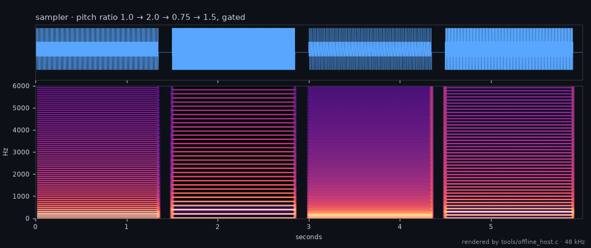

# sampler — reference sampler plugin (M15, #167)

A worked sampler built on the SDK streaming sampler (`tessera_sampler`, #165): it
plays a short bundled sample, looped, at a controllable pitch. Because the sampler
reads through a fixed ring, its memory is bounded no matter how it is driven — the
isolation guarantee that motivates the design. Two factory presets are embedded in
the ELF (#127): **Normal** and **OctaveUp**.

## Control

| param | meaning |
|-------|---------|
| 0 | pitch ratio (1.0 = original, 2.0 = octave up) |
| 1 | gate (≥ 0.5 plays, else silent) |

In a real deployment the sample would be streamed from the SD card by the host;
here it is a small embedded waveform so the plugin is self-contained.

## Listen

The bundled waveform is a 512-sample, two-cycle decaying sine, so looped it is a
buzzy test tone rather than a musical sample. The demo steps the pitch ratio
1.0 → 2.0 → 0.75 → 1.5 with short gate gaps
([MP3](../../docs/media/audio/sampler-pitch.mp3?raw=true) ·
[MP4](../../docs/media/audio/sampler-pitch.mp4?raw=true)):

## Build / test

- `make test-arm-ref-sampler` — drives it through the C ABI, checks it plays and
  gates, stays bounded under pitch change, and that the embedded presets parse.
- `make offline-host-sampler` — links it into the offline host to render a WAV.
