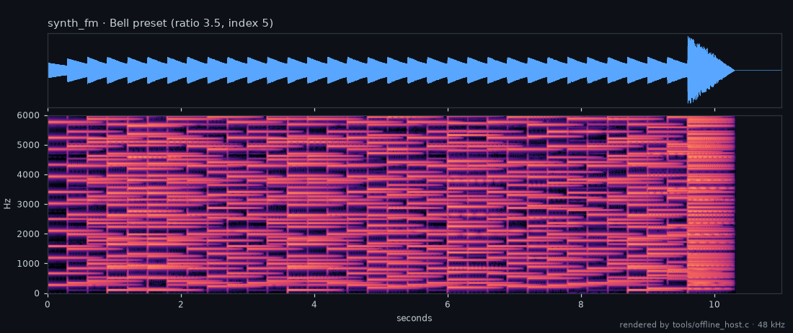

# synth_fm — reference FM synth plugin (M15, #167)

A worked polyphonic synth built entirely on the SDK: note events drive the SDK's
polyphonic voice engine (`tessera_synth`, #113) in two-operator FM mode (#164). It
proves the synth-voice path end to end and ships two factory presets embedded in
the ELF (`.tessera.presets`, #127): **Bell** and **Bass**.

## Listen

Both factory presets, rendered by the offline host from the automation in
[`docs/media/demos/`](../../docs/media/demos/) (desktop renders of this source, not a
hardware recording):

| Preset | Listen | |
|--------|--------|-|
| **Bell**: ratio 3.5, index 5 | [MP3](../../docs/media/audio/fm-bell.mp3?raw=true) · [MP4](../../docs/media/audio/fm-bell.mp4?raw=true) | arpeggiated Cmaj7 → Am9 → Fmaj7 → G6 |
| **Bass**: ratio 1, index 2 | [MP3](../../docs/media/audio/fm-bass.mp3?raw=true) · [MP4](../../docs/media/audio/fm-bass.mp4?raw=true) | sixteenth-note A-minor line, 120 BPM |

## Control

Live builds drain note events from the event queue (ABI v1.1). Every build also
accepts scripted notes through parameters, so the offline host (#128) renders it
deterministically from a param CSV:

| param | meaning |
|-------|---------|
| 0 | note-on (value = MIDI note) |
| 1 | note-off (value = MIDI note) |
| 2 | FM ratio |
| 3 | FM index |
| 4/5/6/7 | attack / decay / sustain / release (ms, sustain 0..1) |

## Build / test

- `make test-arm-ref-synth` — drives it through the C ABI, checks it sounds at the
  played pitch (440 Hz for A4) and that the embedded presets parse and apply.
- `make offline-host-synth` — links it into the offline host to render a WAV.
